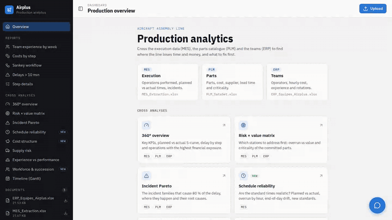

# PLM Production Analytics

Dashboard for an aircraft assembly line. It joins three Excel extracts:

- **MES** (`MES_Extraction.xlsx`): the operations actually performed, with planned and actual times and incidents;
- **PLM** (`PLM_DataSet.xlsx`): the parts, their cost, supplier, lead time and criticality;
- **ERP** (`ERP_Equipes_Airplus.xlsx`): the operators, their station, hourly cost, experience and weekly rotation.

It shows station and step reports, nine cross analyses, and a chatbot (Gemini) that answers questions about the files.

Built with a **Flask + pandas + Plotly** backend and a **React + Vite** frontend.



## Quick start

### Docker (recommended)

```bash
GEMINI_API_KEY=your_key docker compose up -d --build   # http://localhost:5000
```

One image builds the frontend and serves it with the API (gunicorn). Uploaded files are kept in the `uploads` volume.

### 1. Backend (Python 3.10+)

```bash
cd backend
python -m venv .venv && source .venv/bin/activate
pip install -r requirements.txt
cp .env.example .env        # then set GEMINI_API_KEY (only needed for the chatbot)
python run.py               # http://localhost:5000
```

Sample data files are already in `backend/uploads/`.

### 2. Frontend (Node 20+)

```bash
cd frontend
npm install
npm run dev                 # http://localhost:5173
```

The frontend calls `http://localhost:5000` by default. Set `VITE_API_URL` in `frontend/.env.local` to change it.

### Tests and checks

```bash
cd backend && python -m pytest       # API, reports, analyses and chatbot logic
cd frontend && npm run lint && npm run build
```

## Features

| Button | Route | What it shows |
|---|---|---|
| Team experience by week | `GET /api/reports/team-experience` | Headcount per week, step and station by experience level (green when ≥ 1/3 experts) |
| Costs by step | `GET /api/reports/step-costs` | Parts + labour cost per step, with a pie chart |
| Sankey workflow | `GET /api/reports/workflow?step=&max_nodes=` | Step → station → part flows |
| Delays > 10 min | `GET /api/reports/delays` | Stations with an average delay above 10 minutes, with incident and cause |
| Step details | `GET /api/reports/step-details?step=` | Parts, people, costs and times of one step |
| Cross analyses | `GET /api/analyses/<name>` | 9 MES × PLM × ERP analyses (incl. schedule reliability, cost structure, workforce & succession), see [docs/cross-analyses.md](docs/cross-analyses.md) |
| Click on an `.xlsx` file | `GET /api/files/<name>/table` | Table preview of the file |
| Chat bubble | `POST /api/chat` | Questions in natural language about the Excel files |

Other routes: `GET /api/files`, `POST /api/upload`, `GET /uploads/<name>`, `GET /api/steps`, `GET /api/analyses`.

## Project structure

```
backend/
├── run.py                       # entry point (python run.py)
├── requirements.txt
├── uploads/                     # source Excel files (sample data included)
├── tests/                       # pytest suite
└── app/
    ├── __init__.py              # create_app() factory
    ├── config.py                # paths, allowed extensions, Gemini settings
    ├── routes/                  # HTTP layer, one blueprint per feature
    │   ├── files.py             #   upload, list, download, table preview
    │   ├── reports.py           #   station / step reports
    │   ├── analyses.py          #   cross analyses
    │   ├── chat.py              #   chatbot
    │   └── frontend.py          #   serves the production build
    ├── processing/              # reading and joining MES / PLM / ERP
    │   ├── columns.py           #   source column names (French headers)
    │   ├── loader.py            #   Excel loading
    │   ├── parsing.py           #   time / lead time / number converters
    │   ├── joins.py             #   reference explosion, ERP rotation, full join
    │   └── costs.py             #   parts and labour costs
    ├── reports/                 # one HTML report per file
    ├── analytics/               # cross analyses
    │   ├── model/               #   joined model (operations, parts, staff)
    │   ├── rendering/           #   page, cards, tables, Plotly layout
    │   └── analyses/            #   one file per analysis
    └── chat/                    # prompt, Gemini call, code execution, formatting

frontend/src/
├── main.jsx, App.jsx
├── api/                         # backend calls (client, files, reports, chat)
├── hooks/                       # dashboard state (files, report, status, steps)
├── constants/analyses.js        # catalogue of the cross analyses and reports
├── components/
│   ├── layout/                  # navigation sidebar, header, step panel, upload
│   ├── preview/                 # home page, report iframe, file preview, fullscreen
│   ├── modals/                  # Sankey settings dialog
│   └── chatbot/                 # chat widget
└── styles/                      # one CSS file per area
```

## How the chatbot works

1. The frontend sends the question to `POST /api/chat`.
2. The backend loads every Excel file in `uploads/` and describes their columns and a sample to Gemini.
3. Gemini writes pandas code that stores its answer in a `result` variable.
4. The code runs on the DataFrames and the result is returned, formatted, with the generated code.

> ⚠️ The generated code runs with full Python rights on the server. Only run the backend on a trusted machine or
> network.

## Production build

```bash
cd frontend && npm run build && cp -r dist ../backend/dist
cd ../backend && python run.py      # the app is served on http://localhost:5000
```

## Troubleshooting

- **"API key not valid" / chatbot error**: check `GEMINI_API_KEY` in `backend/.env`.
- **"Backend unreachable"**: make sure `python run.py` is running on port 5000.
- **Charts are blank**: the reports load Plotly.js from `cdn.plot.ly`, so the browser needs internet access.
